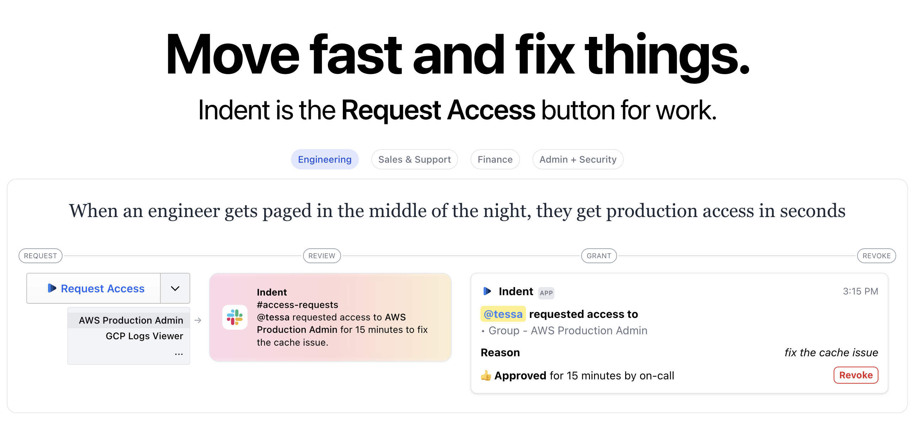
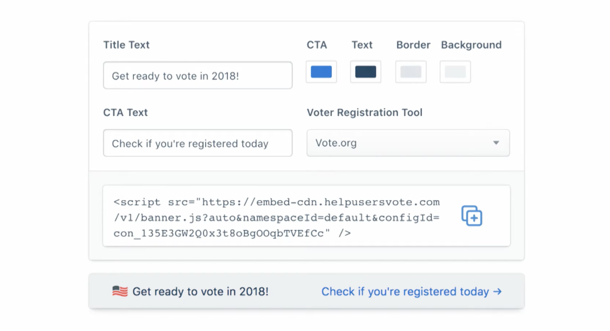
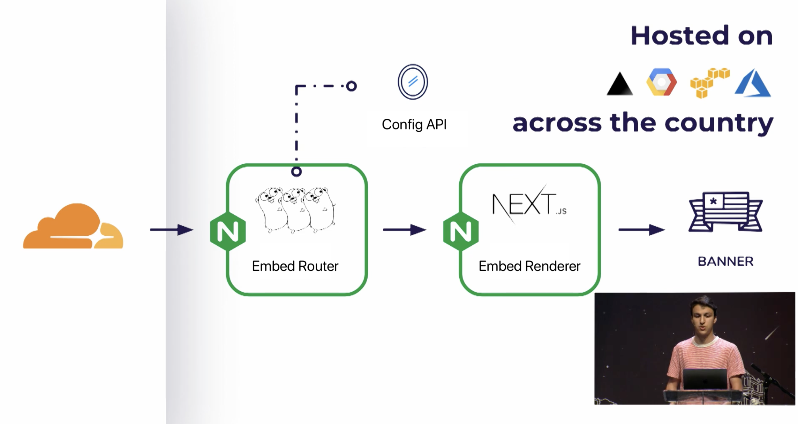
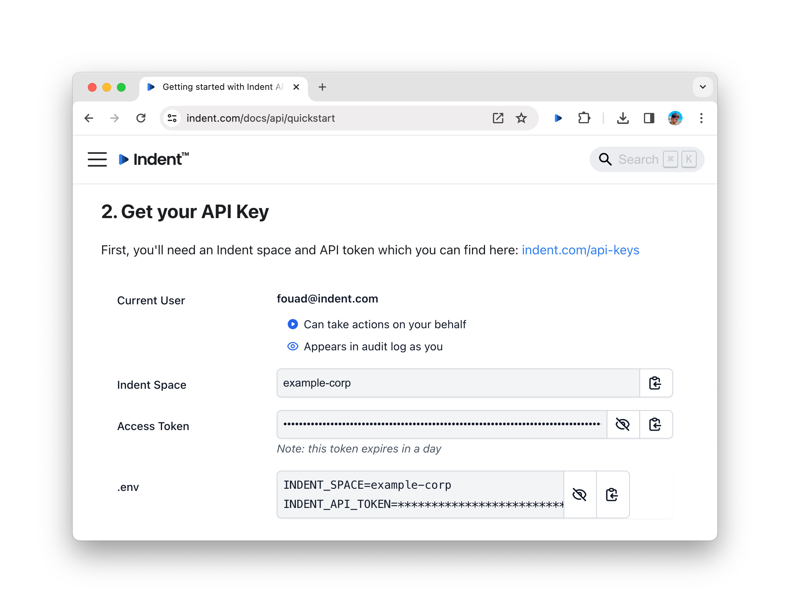

# Routing for the Modern Frontend

---

<div class="text-left">

Hi, I'm Fouad.

Over the last few years, I've worked on ...

- Helping a few million people vote in 2016 with a nonprofit I cofounded + again in 2018 with [Vote.org](https://vote.org)
- Building new customer data products and supporting open source at [Segment](https://segment.com)

Now, I run a security company: [Indent.com](https://indent.com)

</div>

---



---

<div class="text-6xl">Before we talk about modern routing, let's talk about how we got here.</div>

---

<div class="text-left">

In 2018, we worked with brands to help their users...

- Check their voter registration
- Find their polling place
- Preview their ballot

We gave partners a one-line snippet they could embed.

</div>

---



---

## User Request Lifecycle

```js
(User) → (Partner Website) ↔ [Embed JS]
                                        → [Config API]
                                        → [Next.js Server]
```

<style>
.center-code .hljs {
  text-align: center;
}
</style>

---

<div class="text-left">

Our goals were:

- 200ms response times across US
- Personalized regional content<br />_(e.g. 23 days left to register in SF)_

It needed to be fast, secure, and reliable.

</div>

---

## Zeit (aka Vercel) Day 2018

[](https://www.youtube.com/watch?v=5CzOYDF0Hdk)

---



---

## 2018 Architecture

- Cloudflare workers for complex cache logic
- Nginx for high-throughput HTTP routing
- Go to serve embed JS
- Next.js for rendering server
  - Replace React with Inferno
  - Drop JS bundle if not needed

---

<div class="text-left">

**Fun moment:** A few days before the election, we started to see a sustained traffic spike.

- 3pm - 5k concurrent
- 4pm - 20k concurrent
- 5pm - 30k concurrent (What is going on!?)
- 6pm - 50k concurrent (Oh no, we're going to crash)
- 7pm - Google Analytics realtime dashboard crashed

</div>

---


---

## How did it go?

- Peaked at 85k concurrent users on Election Day
- Helped 3.3 million find their polling place
- Around 1.1 million previewed their ballot

---

## What's new in 2024?

- Framework-defined infrastructure
- Powerful compute at the edge
- Streaming is critical for AI features

---

### Front door for <br /> Framework-defined infrastructure

- Marketing — indent.com — Next.js (Vercel)
- Docs — indent.com/docs — Docusaurus (Vercel)
- App — indent.com/home — Next.js (self-hosted)

---

### Routing at the edge

In order to share one root domain across multiple frameworks, we handle routing at the edge:

```js
addEventListener('fetch', event =>
  event.respondWith(handleRequest(event))
)

async function handleRequest(event) {
  try {
    if (event.request.method === 'GET') {
      let response = await serveAsset(event)

      return await addSecurityHeaders(response)
    }

    ...
```

---

Adding asset prefix for the framework:

```js
/** @type {import('next').NextConfig} */
const isProd = process.env.NODE_ENV === 'production'
const assetUrl = process.env.VERCEL_URL || 'my.vercel.app'
const assetPrefix = isProd ? `https://${assetUrl}` : ''

module.exports = {
  assetPrefix,

  ...
}
```

---

<div class="-mt-8 h-[90vh] tall-code">

```js
async function serveAsset(event) {
  const url = new URL(event.request.url)
  let { pathname, search } = url
  let cache = caches.default
  let response = await cache.match(event.request)

  if (response && response.status < 400) {
    return response
  }

  if (shouldServeDashboard(pathname)) {
    // Remove assetPrefix for dashboard Next.js App
  } else if (shouldServeDocs(pathname)) {
    // Remove assetPrefix for docs Docsaurus 2.0 site
  } else {
    // Serve marketing Next.js App
  }

  if (response.status < 400) {
    const res = response.clone()
    event.waitUntil(cache.put(event.request, res))
  }

  return response
}
```

</div>

<style>
.tall-code .code-wrapper {
  height: 100%;
  font-size: 21px;
}
</style>

---

<div class="relative z-10">

**Share context across frameworks**

</div>

<div class="-mt-20 relative -z-1">



</div>

---

<div class="relative z-10">

**Streaming for AI features** (Cloudflare)

</div>

<div class="-mt-4 relative -z-1 h-[65vh] tall-code">

```js
import { Ai } from '@cloudflare/ai'

export default {
  async fetch(request, env, ctx) {
    const ai = new Ai(env.AI, { sessionOptions: { ctx: ctx } })
    const stream = await ai.run(
      '@cf/meta/llama-2-7b-chat-int8',
      {
        prompt: 'Where is new york?',
        stream: true,
      }
    )
    return new Response(stream, {
      headers: { 'content-type': 'text/event-stream' },
    })
  },
}
```

</div>

---

**Streaming for AI features** (Vercel)

<div class="center-code">

```shell
npm i ai
```

</div>

```js
import { OpenAIStream, StreamingTextResponse } from 'ai'
import { Configuration, OpenAIApi } from 'openai-edge'

// Create an OpenAI API client (that's edge friendly!)
const config = new Configuration({
  apiKey: process.env.OPENAI_API_KEY
})
const openai = new OpenAIApi(config)
 
// IMPORTANT! Set the runtime to edge
export const runtime = 'edge'
 
export async function POST(req: Request) {
  // Extract the `messages` from the body of the request
  const { messages } = await req.json()
 
  // Ask OpenAI for a streaming chat completion given the prompt
  const response = await openai.createChatCompletion({
    model: 'gpt-3.5-turbo',
    stream: true,
    messages
  })
  // Convert the response into a friendly text-stream
  const stream = OpenAIStream(response)
  // Respond with the stream
  return new StreamingTextResponse(stream)
}
```

---

## Takeaways

1. Handle requests close to your users (edge)
1. Use the right tool for the job (frameworks)
1. Reduce wait times with streaming (AI)

Questions? [@fouadmatin](https://x.com/fouadmatin)

Interested in better security?<br />
Check out [indent.com](https://indent.com)
